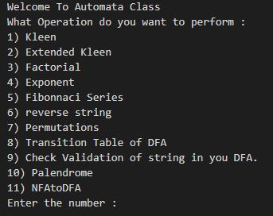

# Class Automata
### This Class Include these Functions
* Kleen 
* Extended Kleen
* Factorial
* Fibonnaci Recursive
* Permutations 
* Transition Table
* Delta
* Palendrome
* NFA to DFA

### After Execution the Program Asks What function would you like to run :

Thank You
